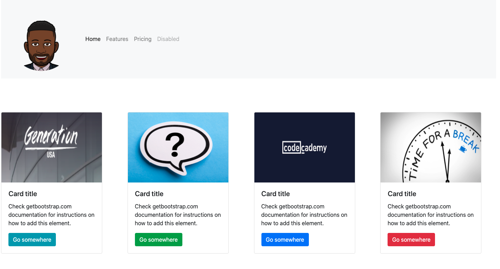

# BootstrapActivity

* **Objective** - Attempt to recreate the website shown below using Bootstrap.
* **Purpose** - To establish familiarity with Bootstrap and use of Bootstrap documentation.
* **Requirements**
    * Navbar with image
    * 4 image top cards with different color buttons (using bootstrap)
    * Appropriate breakpoints for cards for various sized screens
    * Does not have to be a perfect recreation, just needs to satisfy the requirements above
    * Feel free to add your own flair or style!

* **Helpful Links** 
    * Cards: https://getbootstrap.com/docs/4.0/components/card/ 
    * Navbar: https://getbootstrap.com/docs/5.0/components/navbar/

    

## Part 1 - Clone the project

* Begin by _forking_ this project into a personal repository.
   * To do this, click the `Fork` button located at the top right of this page.
* Navigate to your github profile to find the _newly forked repository_.
* Clone the repository from **your account** into the directory on your computer that you use to keep your projects (ex. `dev` directory).
    - Remember this from the lessons on Git and Github?
        - Go to the green `Code` button in the top right of this repository
        - Select `https` and then COPY that url
        - Open Git Bash on your computer, `cd` to a directory where you wish to save this assignment to work on
        - Type `git clone ` followed by the URL you copied from Github
        - `cd` into the repository for this assignment you have just cloned, `BootstrapPractice`
* Open the newly cloned project in a code editor (ex. Visual Studio Code). _If you do not yet has VSCode, it's okay, you can also edit the files in Notepad or a similar text editor._

### Part 2 - Edit the _cloned_ project

* from a text editor (i.e. - Visual Studio Code, Notepad ++, etc...), select:
  * `File` > `Add Folder to WorkSpace`
    * Select the directory you use to store your projects (ex. `dev` directory) 
    * From the text editor,in the directory you use to store your projects (ex. `dev` directory), locate the newly cloned project `BootstrapPractice`
    * Expand the project from the _project explorer (may just be called `explorer`)_
    * Modify the `index.html` and `style.css` (if needed) to complete the assignment.
    

### Part 3 - _Pushing_ new changes to repository

* From a _terminal_ navigate to the root directory of the _cloned_ project.
* From the root directory of the project, execute the following commands:
    * `git add .`
        * Add all files in current directory to the staging area       
    * `git commit -m 'I have made an edit to a file!'`
        * Save all staged changes to local repository
    * `git push -u origin main`
        * Push changes from local repository to remote repository

### Part 4 - Submitting assignment

* From the browser, navigate to the _forked_ project from **your** Github account.
* Click the `Pull Requests` tab.
* Select `New Pull Request`
